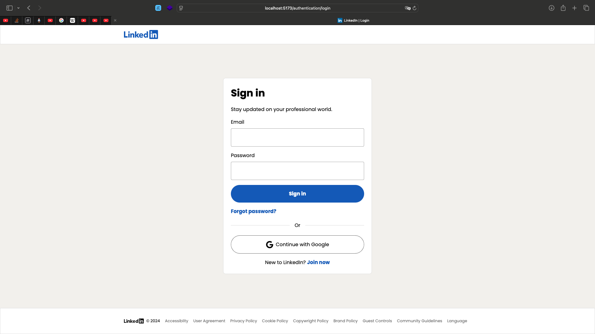

## Running the project on your machine

### Prerequisites

Node.js (version 22 or compatible), npm (version 10 or compatible),
Java JDK (version 21), and Docker (version 24.0.7 or compatible).

#### Backend Setup

Navigate to the backend directory:

```
cd backend
```

Run the docker containers:

```
docker-compose up
```

Set up continuous build:

_Mac/Linux:_

```
./gradlew build -t -x test
```

_Windows:_

```
gradlew.bat build -t -x test
```

Configure environment variables for OAuth 2.0 and OIDC, aka the Continue with Google button. Give fake values if you do not want to test this feature:

_Mac/Linux:_

```
export OAUTH_GOOGLE_CLIENT_ID=your_google_client_id
export OAUTH_GOOGLE_CLIENT_SECRET=your_google_client_secret
```

_Windows:_

```
set OAUTH_GOOGLE_CLIENT_ID=your_google_client_id
set OAUTH_GOOGLE_CLIENT_SECRET=your_google_client_secret
```

Run the backend:

_Mac/Linux:_

```
./gradlew bootRun
```

_Windows:_

```
gradlew.bat bootRun
```

#### Frontend Setup

Navigate to the frontend directory:

```
cd frontend
```

Set up the necessary environment variables:

_Mac/Linux:_

```
cp .env.example .env
```

_Windows:_

```
copy .env.example .env
```

⚠️: make sure all variables are populated. Give fake value for `VITE_GOOGLE_OAUTH_CLIENT_ID` if you do not want to test Oauth 2.0 and OIDC.

Install dependencies:

```
npm install
```

Run the frontend in development mode:

```
npm run dev
```

You can access the backend at `http://localhost:8080`, the frontend at `http://localhost:5173`, and the Mailhog SMTP server UI at `http://localhost:8025`.

The database hostname is `127.0.0.1`, the port is `3306`, and the root password is `root`.
